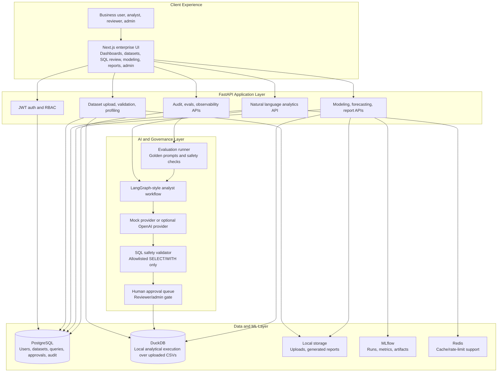
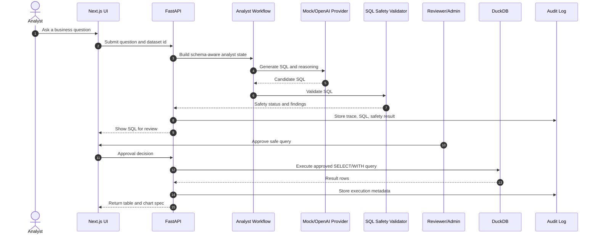

# Enterprise AI Data Analyst & Forecasting Copilot

An end-to-end, local-first enterprise analytics SaaS that turns business questions into governed SQL, charts, churn predictions, revenue forecasts, model cards, executive reports, evaluations, and audit logs.

This project is built as a portfolio-grade AI engineering product, not a notebook demo. It demonstrates full-stack product engineering, agentic AI workflow design, analytics engineering, ML experimentation, SQL governance, model risk awareness, and local-first infrastructure.

## Project Snapshot

**One-line summary:** Built an enterprise-grade AI Data Analyst and Forecasting Copilot using FastAPI, LangGraph, DuckDB, PostgreSQL, scikit-learn, MLflow, Next.js, Docker, and SQL approval workflows.

**Best-fit roles this project demonstrates:**

- AI Engineer
- GenAI Engineer
- Agentic AI Builder
- Data Scientist
- Analytics Engineer
- ML Engineer
- LLMOps Engineer
- Full-Stack Product Engineer

**What makes it stand out:**

- Real SaaS-style product, not a chatbot wrapper.
- Local-first and reproducible with Docker Compose.
- Governance-first AI workflow: generated SQL is validated and requires human approval before execution.
- Practical ML workflows: churn model training, feature importance, risk scoring, revenue forecasting, MLflow logging, model cards.
- Enterprise polish: RBAC, audit logs, approval queue, data quality dashboard, evaluation runner, observability/admin screens.
- Optional OpenAI provider support while keeping deterministic mock providers for tests and local demos.

## Product Story

Business users often ask questions like:

> "Why did churn increase, which customers are at risk, and what should we do next?"

This product answers that through a governed analytics workflow:

1. Upload a customer or revenue CSV.
2. Validate and profile the dataset.
3. Inspect schema, sample rows, and data quality warnings.
4. Ask a natural-language analytics question.
5. Generate SQL through a mock or optional OpenAI provider.
6. Validate SQL against a strict allowlist.
7. Require reviewer/admin approval.
8. Execute approved SQL in DuckDB.
9. Return result tables and Plotly chart specs.
10. Train churn models, score at-risk customers, forecast revenue, and generate executive reports.
11. Log traces, audit events, evaluations, and model metadata.

## Feature Highlights

### AI Analytics Copilot

- Natural-language question intake.
- Intent classification for analytics, EDA, modeling, and forecasting.
- Mock/local deterministic SQL provider for no-key demos.
- Optional OpenAI-compatible SQL/report generation.
- LangGraph-style workflow with persisted trace records.
- Critic-style final review node for unsupported-claim awareness.

### SQL Governance

- Only single-statement `SELECT` or `WITH` queries are allowed.
- Blocks DDL/DML, multiple statements, DuckDB external file access, `COPY`, `ATTACH`, `INSTALL`, `LOAD`, `PRAGMA`, and sensitive columns.
- Blocks wildcard projections when sensitive-pattern columns exist.
- Validates table and column references.
- Requires human approval before query execution.
- Stores generated SQL, safety findings, approval status, execution status, result metadata, charts, and audit logs.

### Data Platform

- CSV upload with file-size limits and safe filenames.
- Dataset validation for required churn columns, invalid dates, negative revenue, duplicate customer IDs, class imbalance, and sensitive columns.
- Dataset profiling with inferred types, missingness, unique counts, numeric summary, sample values, duplicate rows, and quality score.
- DuckDB loading for local analytical execution.
- PostgreSQL metadata schema for app state.

### Data Science and ML

- Churn classification with scikit-learn RandomForest.
- Numeric/categorical preprocessing pipeline.
- Accuracy, F1, and ROC AUC metrics.
- Feature importance extraction.
- Customer risk scoring with risk bands and recommended actions.
- Revenue forecasting with a local regression workflow.
- MLflow tracking for training/forecast runs.
- Model cards with intended use, limitations, risk notes, and monitoring recommendations.

### Enterprise App Surface

- JWT authentication.
- Role-based access control: `admin`, `analyst`, `reviewer`, `viewer`.
- Dataset ownership checks.
- Approval queue.
- Reports page.
- Evaluations dashboard.
- Admin analytics and observability.
- Audit logs.
- Role-aware navigation.

## Tech Stack

| Layer | Tools |
| --- | --- |
| Frontend | Next.js App Router, React, TypeScript, Tailwind CSS, Plotly, Lucide icons |
| Backend | FastAPI, Pydantic v2, SQLAlchemy 2, Alembic |
| Analytics | DuckDB, Pandas |
| ML | scikit-learn, MLflow |
| Agent Workflow | LangGraph-style state workflow |
| Metadata DB | PostgreSQL locally via Docker Compose |
| Cache/Rate Limit | Redis service plus simple local rate limiter |
| Auth/Governance | JWT, bcrypt, RBAC, approval workflows, audit logs |
| Quality | pytest, ruff, mypy, TypeScript, Next build, npm audit |
| Infrastructure | Docker Compose, Makefile, GitHub Actions |

## Architecture Diagram

The architecture separates the product UI, API layer, metadata store, analytical execution engine, ML workflow, and AI governance path. This is intentionally closer to an internal enterprise SaaS than a notebook or single-page chatbot demo.



## Governed AI Workflow

Generated SQL is treated as untrusted input. The product validates, records, and routes it through human approval before any query can run against DuckDB.



## Repository Structure

```text
backend/              FastAPI app, services, agents, ML, evals, tests, Alembic
frontend/             Next.js app router UI, components, API client, types
demo-data/            Synthetic churn, revenue, and evaluation data
docs/                 Architecture, security, SQL safety, model governance, evals
scripts/              Demo data generator
.github/workflows/   CI pipeline
docker-compose.yml    Local Postgres, Redis, MLflow, backend, frontend
Makefile              Common local commands
```

## Local Quickstart

### 1. Create `.env`

Use the included `.env.example` or create `.env` with local defaults.

The app works without an OpenAI key:

```env
SQL_GENERATOR_PROVIDER=mock
REPORT_GENERATOR_PROVIDER=mock
OPENAI_API_KEY=
```

To enable OpenAI-backed SQL/report generation:

```env
SQL_GENERATOR_PROVIDER=openai
REPORT_GENERATOR_PROVIDER=openai
OPENAI_API_KEY=your_key_here
```

Tests always force mock providers so CI and local verification do not spend API credits.

### 2. Generate Demo Data

```bash
make demo-data
```

### 3. Start the Local Product

```bash
docker compose up --build
```

Then open:

- Frontend: `http://localhost:3000`
- Backend health: `http://localhost:8000/health`
- MLflow: `http://localhost:5000`

### 4. Run Migrations and Seed Users

```bash
make migrate
make seed
```

Demo users use `DemoPassword123!`:

| Email | Role |
| --- | --- |
| `admin@example.com` | Admin |
| `analyst@example.com` | Analyst |
| `reviewer@example.com` | Reviewer |
| `viewer@example.com` | Viewer |

## Demo Walkthrough

Use this flow for a 3 to 5 minute portfolio demo:

1. Log in as `analyst@example.com`.
2. Upload `demo-data/customer_churn.csv`.
3. Validate the dataset and show the data quality profile.
4. Load the dataset to DuckDB.
5. Ask: `Which customer segments have the highest churn rate?`
6. Show generated SQL and safety validation.
7. Approve SQL as reviewer/admin.
8. Execute SQL and show result table/chart.
9. Train the churn model.
10. Show model metrics, feature importance, and at-risk customers.
11. Upload or use `demo-data/monthly_revenue.csv`.
12. Run revenue forecasting.
13. Generate an executive report.
14. Show evaluation results, audit logs, and observability.
15. Explain future Supabase/deployment plans.

Full script: [`docs/demo-script.md`](docs/demo-script.md)

## Verification

These checks were used during development:

```bash
cd backend
python -m ruff check .
python -m mypy app
python -m pytest -q
python -m app.scripts.run_evals
python -m app.scripts.smoke

cd ../frontend
npm run typecheck
npm run build
npm audit --audit-level=moderate

cd ..
docker compose config
```

Expected status:

- Backend lint: passing.
- Backend typecheck: passing.
- Backend tests: passing.
- Frontend typecheck: passing.
- Frontend build: passing.
- npm audit at moderate level: passing.
- Docker Compose config: valid.

## Security and Governance

Implemented local enterprise security basics:

- JWT authentication.
- bcrypt password hashing.
- RBAC dependencies.
- Least-privilege public registration.
- Dataset ownership checks.
- Upload extension/size checks and parser cleanup.
- SQL allowlist validation.
- Sensitive-column detection.
- Wildcard projection blocking for sensitive schemas.
- Human approval before SQL execution.
- Query ownership checks for results/charts/traces.
- Audit logs for key workflows.
- `.env` is ignored and not committed.

See [`docs/security.md`](docs/security.md) and [`docs/sql-safety.md`](docs/sql-safety.md).

## AI Provider Design

The product supports two modes:

### Mock/local mode

Default mode for demos, tests, and CI. It is deterministic and requires no external key.

### OpenAI mode

Optional mode for SQL/report generation. Provider outputs are still passed through the SQL safety validator before any execution path. If provider output is malformed or unsafe, the app falls back safely instead of executing untrusted SQL.

## Data Science Details

The included synthetic churn data models realistic patterns:

- Month-to-month contracts have higher churn.
- Payment failures increase churn likelihood.
- More support tickets increase churn likelihood.
- Lower usage increases churn likelihood.
- Annual and multi-year contracts reduce churn.
- Enterprise customers have different revenue patterns.

The revenue dataset includes 24 months of customer/revenue dynamics:

- New customers.
- Active customers.
- Churned customers.
- Expansion revenue.
- Contraction revenue.
- Marketing spend.
- Support cost.
- Total revenue.

## What Is Intentionally Not Included

This is local-first by design. It intentionally does not implement:

- Supabase.
- Cloud deployment.
- Vercel, Render, Railway, Fly.io, AWS, GCP, Azure.
- Kubernetes or Terraform.
- Billing/payments.
- Enterprise SSO.
- Real Slack/Jira/GitHub automation integrations.
- Web crawling or email ingestion.
- Production secrets.

Future plans are documented, not implemented:

- [`docs/future-supabase-plan.md`](docs/future-supabase-plan.md)
- [`docs/future-deployment-plan.md`](docs/future-deployment-plan.md)

## License

Portfolio project for local demonstration and learning. Add a formal license before public reuse.
