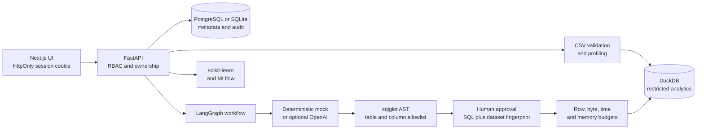

# Enterprise AI Data Analyst & Forecasting Copilot

[](https://github.com/KarthikRamesh9149/enterprise-ai-data-analyst-copilot/actions/workflows/ci.yml)
[](LICENSE)

A local-first analytics product that turns business questions into governed SQL, charts, churn scores, revenue forecasts, model cards, and executive reports. It is designed to demonstrate the boundary that matters in enterprise AI: model output is untrusted until deterministic controls and a human approval gate authorize one exact operation over one exact dataset version.


## Why this project exists

Notebook demos usually collapse generation, authorization, and execution into one step. This application separates them. An analyst uploads and profiles a CSV, asks a question, reviews generated SQL, obtains approval from a reviewer, and only then executes a cryptographically bound query in DuckDB. The rest of the product includes traceable agent planning, ML workflows, evaluations, reports, RBAC, and audit records.

The default experience is offline and deterministic. No API key, network model call, or paid service is required.

## Architecture



Core boundaries:

- `frontend/`: Next.js App Router UI. Browser sessions use an `HttpOnly`, `SameSite=Lax` cookie; bearer tokens are not persisted in `localStorage`.
- `backend/app/api/`: authentication, datasets, analytics, approvals, modeling, forecasting, reports, evaluations, and administration.
- `backend/app/services/sql.py`: generation, AST validation, immutable approval fingerprints, restricted DuckDB execution, and materialization budgets.
- `backend/app/agents/`: a traceable LangGraph intent/schema/planner/critic workflow.
- `backend/app/ml/`: local churn and forecasting workflows with MLflow metadata.

## Governed query lifecycle

1. The analyst selects a dataset. Its content hash, generated table identifier, row count, and typed schema form the dataset fingerprint.
2. The mock or optional external provider proposes SQL. Provider output has no authority.
3. `sqlglot` parses exactly one `SELECT`/`WITH` statement. Every physical table must equal the selected dataset table; catalog/schema-qualified and extra tables are rejected. Columns must exist in the dataset schema, external access and mutating operations are blocked, and sensitive-name columns are denied.
4. Approval revalidates normalized SQL and stores SHA-256 fingerprints of both that SQL and the dataset version.
5. Execution revalidates everything and compares both fingerprints. Any SQL, schema, content, table, or dataset metadata drift revokes the approval.
6. DuckDB runs with external access disabled and a memory limit. A timer interrupts long work, rows are streamed in batches, and row and byte caps are checked before a DataFrame or chart is materialized.

Default execution limits are configurable:

| Control | Default | Environment variable |
| --- | ---: | --- |
| Returned rows | 1,000 | `SQL_MAX_ROWS` |
| Materialized result bytes | 5,000,000 | `SQL_MAX_RESULT_BYTES` |
| Wall-clock execution | 5 seconds | `SQL_TIMEOUT_SECONDS` |
| DuckDB memory | 256 MB | `SQL_MEMORY_LIMIT_MB` |
| CSV upload | 25 MB | `MAX_UPLOAD_SIZE_MB` |

Exceeding a limit fails closed; partial results are not persisted.

## Local quickstart

Requirements: Docker with Compose, or Python 3.11+ and Node.js 24 for running services individually.

```bash
cp .env.example .env
docker compose up --build
```

In another shell:

```bash
make migrate
make seed
```

Open the UI at `http://localhost:3000`, API health at `http://localhost:8000/health`, and MLflow at `http://localhost:5000`.

`.env.example` explicitly enables a fixed secret only for the local demo. Any non-local environment fails closed unless `JWT_SECRET` is set to at least 32 characters. Set `AUTH_COOKIE_SECURE=true` behind HTTPS. CORS origins must be exact same-origin frontends because cookie-authenticated mutations reject missing or unapproved `Origin` headers.

Seeded local accounts use `DemoPassword123!`: `admin@example.com`, `analyst@example.com`, `reviewer@example.com`, and `viewer@example.com`. Public registration always creates a viewer regardless of the submitted role.

## Provider and cost behavior

`SQL_GENERATOR_PROVIDER=mock` and `REPORT_GENERATOR_PROVIDER=mock` are the defaults. This path is deterministic, works offline, and makes zero paid calls. Tests force mock mode. The repository does not contain a key.

Setting a provider to `openai` and supplying `OPENAI_API_KEY` opts into external processing and usage billed by that provider. SQL and report calls use `OPENAI_CHAT_MODEL` (default `gpt-4.1-mini`), temperature `0`, and `MAX_OUTPUT_TOKENS=1200`. Malformed provider output falls back to deterministic local generation; provider SQL never bypasses governance. Treat uploaded schemas/questions sent in this mode as data disclosed to the provider and apply your organization’s retention and classification policy.

## Security model

- Passwords are bcrypt-hashed; signed JWTs are transported to the browser in an `HttpOnly`, `SameSite=Lax` cookie. API clients may still use bearer tokens.
- RBAC distinguishes admin, analyst, reviewer, and viewer permissions. Dataset ownership is enforced for processing and execution.
- Public registration cannot self-assign elevated roles.
- CSV uploads are extension-checked, size-capped, hashed, safely renamed, parsed, and profiled.
- SQL uses a parsed physical-table/catalog allowlist, schema column allowlist, sensitive-name denial, immutable approval binding, and execution budgets.
- DuckDB external access is disabled for governed execution. DDL/DML, multiple statements, `COPY`, `ATTACH`, `INSTALL`, `LOAD`, `PRAGMA`, and external readers are denied before execution.
- Approval and execution decisions are auditable; query results and charts retain ownership checks.

Production deployments still need HTTPS, a secret manager, a hardened reverse proxy, centralized identity/SSO, database-level tenant isolation, encrypted storage, log redaction/retention, malware/content inspection, backup/restore drills, and distributed rate limiting. The included rate limiter and local storage are demo-grade, not a production perimeter.

## Threat model

| Threat | Implemented mitigation | Remaining operational responsibility |
| --- | --- | --- |
| Prompt-generated destructive SQL | Single-statement read-only AST validation | Keep dependencies patched and expand adversarial evals |
| Cross-dataset/catalog access | Exact physical-table allowlist; qualified tables rejected | Add database tenant policies for multi-tenant production |
| Approval changed after review | Hash binding to normalized SQL and dataset fingerprint, checked again at execution | Protect metadata DB and reviewer identities |
| Expensive/result-amplifying query | time, memory, row, and byte caps; streaming fetch | Isolate workers and apply OS/container CPU quotas |
| Browser token theft through JavaScript | `HttpOnly` cookie; no persistent JS token storage | CSP, HTTPS, dependency governance, XSS testing |
| CSRF with cookie auth | SameSite cookie and exact-Origin check on mutations | Keep frontend/API origins aligned; add proxy-level origin controls |
| Weak deployment secret | no fallback outside explicitly enabled local demo | Provision and rotate a 32+ character secret |
| Sensitive column disclosure | sensitive-name detection and query denial | Data classification/DLP beyond name heuristics |

## Verification

Run the same deterministic gates as CI:

```bash
make verify
cd backend && python -m app.scripts.run_evals && python -m app.scripts.smoke
cd ../frontend && npm audit --audit-level=moderate
cd .. && docker compose config
```

`make verify` runs demo-data generation, Ruff, mypy, pytest, TypeScript type checking, and the production frontend build. Tests include adversarial catalog access, approval drift, query-budget enforcement, cookie sessions, production-secret failure, real validator use, and signal-derived agent confidence. No test enables a paid provider.

## Product capabilities

- CSV validation, schema inspection, profiles, samples, quality warnings, and DuckDB loading.
- Natural-language analytics with deterministic or optional model-backed SQL generation.
- Approval queue, result tables, Plotly chart specifications, query history, and audit events.
- Churn training and scoring with scikit-learn, feature importance, risk bands, and model cards.
- Revenue forecasting, executive report generation, MLflow metadata, evaluation cases, and agent traces.

Detailed design and operating notes: [architecture](docs/architecture.md), [SQL safety](docs/sql-safety.md), [security](docs/security.md), [evaluations](docs/evaluation.md), [local development](docs/local-development.md), [API](docs/api.md), and the [case study](CASE_STUDY.md).

## Scope and limitations

This is a local-first reference product, not a claim of production certification. It intentionally does not include cloud deployment, SSO, billing, Kubernetes/Terraform, a durable distributed job system, or regulatory compliance certification. Model metrics on synthetic demo data do not establish real-world performance. Human approval authorizes query execution; it does not guarantee that a business interpretation is correct.

## License

MIT. See [LICENSE](LICENSE).
