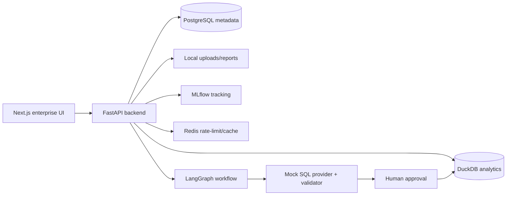

# Enterprise AI Data Analyst & Forecasting Copilot

Local-first enterprise analytics SaaS for portfolio demonstrations across AI engineering, data science, analytics engineering, ML engineering, and LLMOps roles.

The product lets a business user upload customer/revenue CSVs, validate and profile data, ask natural-language business questions, generate safe SQL, require human approval before DuckDB execution, view tables and charts, train churn models, score at-risk customers, forecast revenue, generate executive reports, run evaluations, and inspect audit/observability dashboards.

## Why This Matters

This repository demonstrates practical AI product engineering rather than a notebook demo: FastAPI APIs, RBAC, SQL governance, DuckDB analytics, deterministic local agent flows, MLflow tracking, scikit-learn modeling, Next.js enterprise UI, tests, CI, Docker Compose, and extension docs for Supabase/deployment.

## Tech Stack

FastAPI, SQLAlchemy 2, Alembic, PostgreSQL, DuckDB, Redis, LangGraph, Pandas, scikit-learn RandomForest, MLflow, Next.js App Router, TypeScript, Tailwind CSS, Plotly, Docker Compose, pytest, ruff, mypy, GitHub Actions.

## Architecture

## Local Setup

1. Copy `.env.example` to `.env` only if you want local overrides.
2. Generate demo data: `make demo-data`.
3. Start services: `make up`.
4. Run migrations: `make migrate`.
5. Seed demo users: `make seed`.
6. Open `http://localhost:3000`.

Demo users all use `DemoPassword123!`: `admin@example.com`, `analyst@example.com`, `reviewer@example.com`, `viewer@example.com`.

## Common Commands

- `make backend-test`
- `make backend-lint`
- `make backend-typecheck`
- `make frontend-typecheck`
- `make frontend-build`
- `make evals`
- `make verify`
- `docker compose config`

## Product Flow

Upload `demo-data/customer_churn.csv`, validate it, inspect schema/profile/sample rows, load it to DuckDB, ask “Which customer segments have the highest churn rate?”, review generated SQL, approve it as reviewer/admin, execute it, then view result rows and chart.

Use Modeling to train a churn RandomForest and show feature importance/risk scores. Use Forecasting with `demo-data/monthly_revenue.csv` for a 3-month revenue forecast. Use Reports for executive report generation. Use Evals/Admin for local evaluation and observability.

## SQL Safety

Only `SELECT` and `WITH` queries are allowed. The validator blocks multiple statements, DDL/DML, external file access, DuckDB install/load/attach/copy features, unknown tables, unknown columns, and sensitive column references. Execution requires human approval.

## Intentionally Not Included

No Supabase implementation, cloud deployment, Vercel/Render/Railway/Fly/AWS/GCP/Azure, Kubernetes, Terraform, billing, SSO, real Slack/Jira/GitHub automations, web crawling, email ingestion, or paid API requirement.
