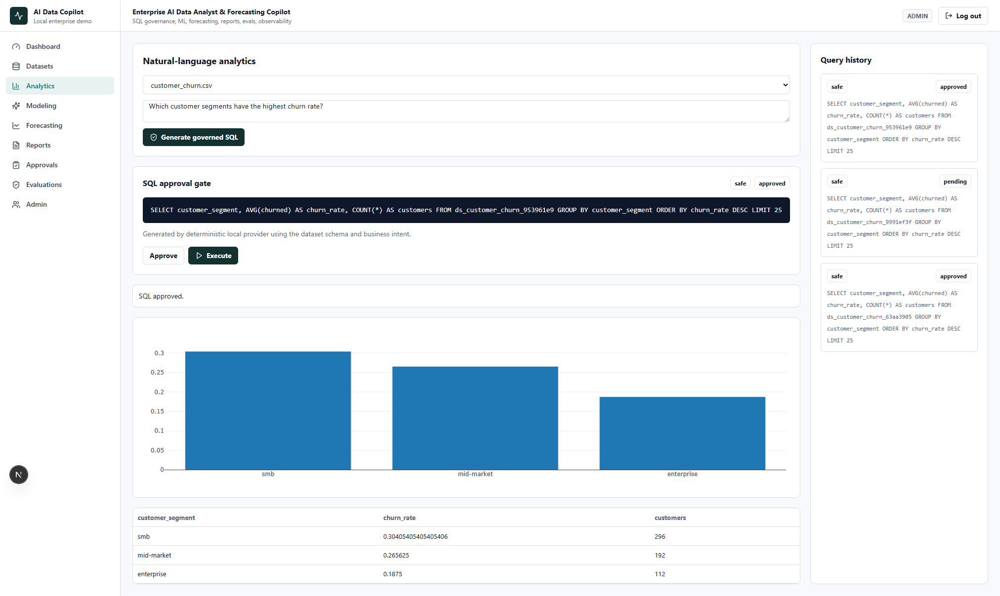
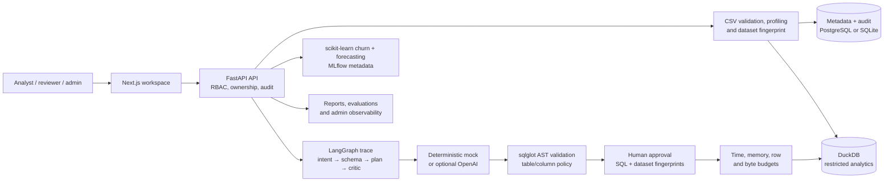

# Enterprise AI Data Analyst & Forecasting Copilot

[](https://github.com/KarthikRamesh9149/enterprise-ai-data-analyst-copilot/actions/workflows/ci.yml)
[](LICENSE)

> Convert a business question into an analysis a reviewer can understand, approve, reproduce, and audit—without granting generated SQL the right to execute itself.

This local-first analytics product gives an analyst one place to validate a CSV, inspect data quality, ask a question, review proposed SQL, run an approval-bound query, explore a chart, train a churn model, forecast revenue, and assemble an executive report. It is designed for the product problem behind enterprise AI analytics: acceleration is only useful when the organisation retains control of data access, execution, and interpretation.



## The user problem

Business teams need answers quickly, but self-service analytics often breaks down in one of two ways: every question becomes a ticket for a data specialist, or a generative tool is allowed to run unreviewed queries against sensitive data. Neither offers a good operating model.

| User | Job to be done | Product response |
| --- | --- | --- |
| Analyst | Answer a dataset-backed business question without hand-writing every query | Upload, profile, ask in natural language, inspect proposed SQL and results |
| Reviewer | Authorize a specific data operation, not a vague model intention | Approve a normalised query tied to one immutable dataset fingerprint |
| Data/ops lead | Understand what ran, why it ran, and what was produced | Query history, agent traces, audit events, reports, evaluation runs, and admin observability |

## Product journey

1. Upload a CSV; the product validates, hashes, profiles, samples, scores data quality, and loads it to DuckDB.
2. Ask a business question such as “Which customer segments have the highest churn rate?”
3. The deterministic local agent records its intent, schema context, plan, and critique; a provider can propose SQL, but it has no authority to execute it.
4. SQL is parsed and constrained to the selected dataset. A reviewer approves the exact normalised query and the dataset fingerprint.
5. Execution re-checks that approval before returning a table or Plotly chart within explicit resource budgets.
6. From the same workspace, analysts can train a churn model, inspect model artefacts and risk scores, forecast revenue, and generate an executive report—with lineage and audit records retained.

## What differentiates the product

- **Approval binds to the thing that will run.** The system stores SHA-256 fingerprints of normalised SQL and the selected dataset version; SQL, schema, content, table, or metadata drift invalidates the approval.
- **Generated SQL is policy-checked, not trusted.** `sqlglot` permits one `SELECT`/`WITH` statement on the selected physical table. Extra or qualified tables, unapproved columns, sensitive-name columns, multiple statements, DDL/DML, `COPY`, `ATTACH`, `INSTALL`, `LOAD`, `PRAGMA`, and external readers are denied.
- **Constraints carry through execution.** DuckDB external access is disabled; a timer, memory ceiling, batch streaming, and row/byte caps protect against expensive or result-amplifying queries.
- **Analytics extends beyond a query editor.** Dataset profiling, Plotly chart specs, churn scoring, feature importance, model cards, revenue forecasting, reports, MLflow metadata, and evaluation cases are product surfaces—not disconnected scripts.
- **The default is reproducible.** Mock SQL and report generators work offline and make no paid calls, keeping the demo and tests deterministic.

## Architecture



## Technology

| Layer | Implementation |
| --- | --- |
| Product UI | Next.js 16, React 19, TypeScript, Plotly |
| Application API | FastAPI, Pydantic, SQLAlchemy, Alembic |
| Analytics execution | DuckDB, `sqlglot`, Pandas, Polars, Pandera |
| Agent workflow | LangGraph-style deterministic intent, schema, planner, and critic trace |
| ML workflows | scikit-learn churn modelling, forecasting, MLflow metadata |
| Provider boundary | Mock SQL/report generators by default; optional OpenAI provider |
| Quality gates | Pytest, Ruff, mypy, TypeScript type checking, production frontend build |

## Demo in five minutes

Requirements: Docker with Compose, or Python 3.11+ and Node.js 24 when running services separately.

```bash
cp .env.example .env
docker compose up --build
```

In another shell:

```bash
make migrate
make seed
```

Open `http://localhost:3000` and sign in as `analyst@example.com` / `DemoPassword123!`. Upload `demo-data/customer_churn.csv`, review the profile, load it to DuckDB, then ask:

> Which customer segments have the highest churn rate?

Show the proposed SQL, safety result, and approval requirement. Continue with a reviewer decision, a result/chart, churn risk scoring, `demo-data/monthly_revenue.csv` forecasting, and an executive report. The full walkthrough is in the [demo script](docs/demo-script.md). MLflow is available locally at `http://localhost:5000`.

The local demo also seeds `admin@example.com`, `reviewer@example.com`, and `viewer@example.com` with the same password. Public registration always creates a viewer.

## Design decisions and tradeoffs

| Decision | Why it matters | Tradeoff |
| --- | --- | --- |
| Human approval before query execution | A reviewer authorises one defined operation on one data version | Adds a deliberate handoff and is unsuitable for fully autonomous execution |
| AST validation over string checks | Policy is applied to parsed SQL structure, physical tables, and columns | A constrained single-dataset query surface is less flexible than a full warehouse IDE |
| Dataset fingerprinting | Detects query or data drift between review and execution | Fingerprints do not replace enterprise catalog governance or tenant policy |
| DuckDB local-first execution | Makes demos deterministic and keeps a bounded analytical runtime close to the product | It is not a production warehouse integration or distributed workload system |
| Mock providers by default | Enables offline, zero-cost development and test gates | Optional model quality must be evaluated separately for a real organisation and schema |

## System limits and success signals

The following defaults are configurable and fail closed; partial over-budget results are not persisted.

| Control | Default | Environment variable |
| --- | ---: | --- |
| CSV upload | 25 MB | `MAX_UPLOAD_SIZE_MB` |
| Returned rows | 1,000 | `SQL_MAX_ROWS` |
| Materialised result size | 5,000,000 bytes | `SQL_MAX_RESULT_BYTES` |
| Wall-clock query time | 5 seconds | `SQL_TIMEOUT_SECONDS` |
| DuckDB memory | 256 MB | `SQL_MEMORY_LIMIT_MB` |
| API rate limit | 60 requests/minute | `RATE_LIMIT_PER_MINUTE` |
| Provider output cap when enabled | 1,200 tokens | `MAX_OUTPUT_TOKENS` |

The evaluation runner stores deterministic intent-classification and SQL-safety cases with pass/fail outcomes. Use that as a local regression signal. It is not an external model benchmark, an accuracy claim for business forecasts, or proof of production readiness.

## Verification

```bash
make verify
make evals
make smoke-test
```

`make verify` generates demo data, then runs Ruff, mypy, Pytest, TypeScript type checking, and a production frontend build. CI and tests use the mock provider path. Targeted coverage includes approval drift, catalog-access attempts, query-budget enforcement, cookie sessions, production-secret failure, validator use, and agent-confidence signals.

## Security and limitations

Browser sessions use signed JWTs in `HttpOnly; SameSite=Lax` cookies; passwords are bcrypt-hashed; server-side RBAC and ownership checks distinguish admin, analyst, reviewer, and viewer. Mutations use an exact-Origin CSRF control. Non-local environments fail closed without a 32+ character `JWT_SECRET`, and production should set `AUTH_COOKIE_SECURE=true` behind HTTPS.

This is a local-first reference product—not production certification. It does not yet include cloud deployment, SSO, billing, Kubernetes/Terraform, durable distributed jobs, database-level tenant isolation, encrypted object storage, full DLP/data classification, malware inspection, centralized identity, or distributed rate limiting. Model metrics on synthetic demo data do not establish real-world performance; reviewer approval makes execution accountable, not every business interpretation correct.

Further reading: [architecture](docs/architecture.md), [SQL safety](docs/sql-safety.md), [security](docs/security.md), [evaluation](docs/evaluation.md), [model governance](docs/model-governance.md), [local development](docs/local-development.md), and [API](docs/api.md).

## License

MIT. See [LICENSE](LICENSE).
